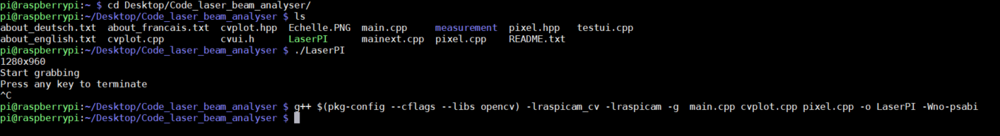

Copier le dossier <em>Code_laser_beam_analyser</em> sur le bureau du <strong>raspberry Pi</strong>.
Le système necessite une <strong>caméra</strong>.

<ul>
<li>1ere méthode, interface classique : 
Aller dans le dossier puis cliquer sur "LaserPI"</li>

<li>2e méthode, Terminal : 
dans LXterminal : 

Se déplacer dans le dossier : cd Desktop/Code_laser_beam_analyser

Demarrage du programme :  ./LaserPI

Compilation (Si LaserPI ne fonctionne pas ou si changement de code) : 
g++ $(pkg-config --cflags --libs opencv) -lraspicam_cv -lraspicam  main.cpp cvplot.cpp pixel.cpp -o LaserPI -Wno-psabi
</li></ul>

  

