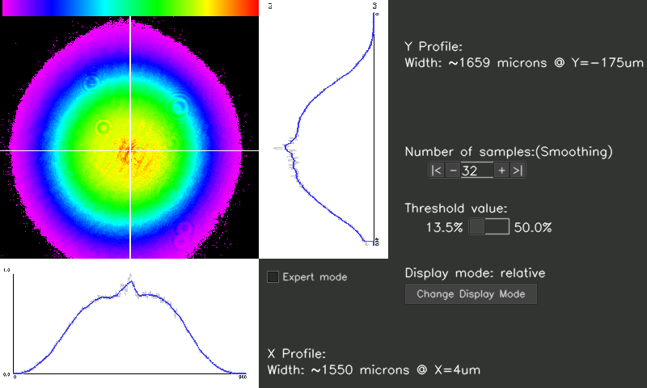
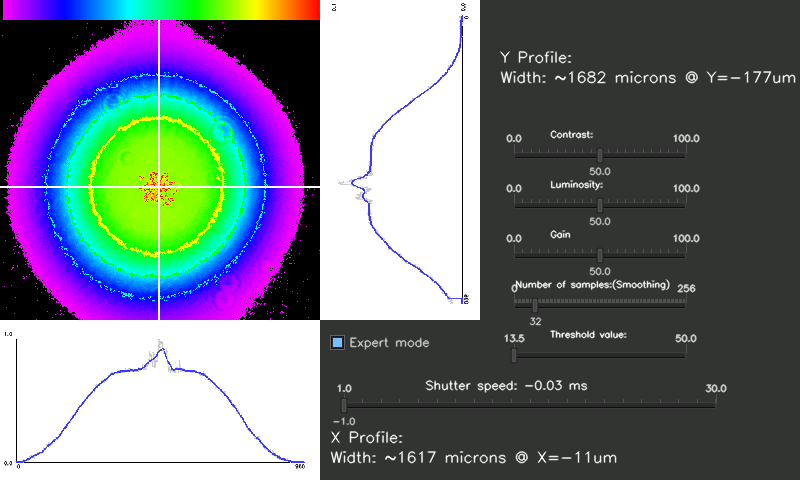
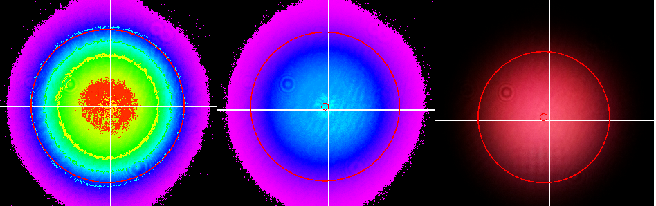
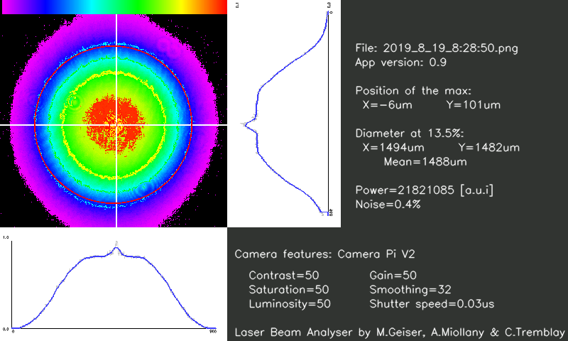

# LaserbeamProfiler

  

<strong>Collaborateurs : </strong>
<ul>
  <li>Martial Geiser</li>
  <li>Frederic Truffer</li>
  <li>Alex Miollany</li>
  <li>Serge Amoos</li>
  <li>Christopher Tremblay</li>
</ul>

<strong>Liste du matériel</strong>
<ul>
  <li>Raspberry Pi, au moins model 3</li>
  <li>Caméra NoIR RaspberryPi Module V2</li>
  <li>Filtres optiques</li>
  <li>Ecran Raspberry Pi 7TD</li>
  <li>Alimentation 5V 2A</li>
</ul>

   
<h3>Présentation</h3>

Un profileur laser est un dispositif coûteux qui est utilisé pour mesurer différentes caractéristiques d'un laser, notamment son diamètre et sa puissance (relative au filtre devant le capteur). Mesures utiles si on veut connaître la focalisation du laser par exemple.  
Le but de ce projet est de concevoir un dispositif simple composé d'un Raspberry Pi, d'une caméra et d'un écran (ici tactile mais pas nécessairement). Le tout dans un boîtier imprimé en 3D. La programmation de ce système est en C++ avec la librairie openCV, langage jusqu'ici le plus rapide pour le traitement d'image. 

  

Le système est composé de plusieurs filtres pour réduire l'intensité du laser arrivant dans la caméra. Le Raspberry prend alors une photo de la "tache", analyse cette image en déterminant les extremums. Le maximum est alors ciblé sur l'image grâce à un viseur.  
Il faut ensuite tracer les profils selon x et y de l'image, qui donnent une distribution normale et permettent de déterminer la taille du laser à 13.5 et 50 pourcent.  
Différents réglages sont ajoutés pour pouvoir modifier les paramètres de l'image comme la saturation ou les contrastes. Les réglages intéressants sont le temps d'exposition, le nombre d'échantillon et le gain de la caméra.  
L'utilisateur aura accès uniquement au nombre d'échantillon (qui lisse la Gaussienne) et au seuil de largeur (critères typiquement utilisés dans la mesure des lasers).  

   
<h3>Interface</h3>

Sur l'illustration ci-dessous le mode normal du dispositif, l'utilisateur a accès à l'image du laser, aux deux profils, aux diamètres selon x et y, à la puissance et à quelques réglages basiques.   
C'est cette interface qui serait utilisée par un utilisateur voulant mesurer les caractéristiques d'un laser dans des conditions normales.

  

Ci-dessous les réglages du mode "expert" du dispositif, ici les réglages plus avancés de la caméra sont disponibles.

  

L'image du laser est disponible selon 3 modes : Normal, absolu et relatif
<ul>
  <li>relatif : c'est l'image modifiée comme précédemment mais le maximum du spectre est le maximum de l'image.</li>
  <li>absolu : c'est l'image avec les couleurs modifiées selon le spectre. On fixe le maximum du spectre à 255 et on aligne les couleurs </li>
  <li>normal : c'est l'image du laser sans traitement après le passage dans les filtres optiques.</li>
</ul>

  

L'utilisateur peut exporter ses résultats en mettant le système en pause : 

  

Le système propose aussi la description du projet via le bouton "about".

   
<h3>Normes pour le calcul du diamètre</h3>

<strong>Formules des premiers moments :</strong> 

  

  
<strong>Formules des seconds moments :</strong> 

  

  

  
<strong>Formules des diamètres :</strong> 

  

  

